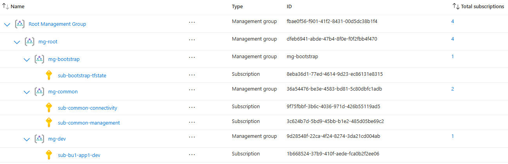

# iac-azure-foundation
This repo shows how to build a secure cloud foundation / landing zone on Azure.

A simple hello-world app which is accessible to authenticated employees over the internet is deployed on Azure Container App (aca). It is made up of frontend webapp (aca), apim and backend api (aca). Easy auth is enabled on frontend and backend.

Stages 00-04 are run locally using terraform service principal. Stages 05-06 are run on github actions. Stage 05 is run using federated uai infra-cicd and Stage 06 is run using federated uai web-cicd and federated uai api-cicd.

## Org hierarchy



## Bootstrap
- Check README.md at 00-bootstrap
- This stage creates terraform bootstrap resources in bootstrap subscription:
    - terraform state container
    - terraform service principal
        - and grants Azure resource roles
        - and grants Azure ad roles

## Org
Mainly org/platform level resources are created in this stage:
- Check README.md at 01-org
- Create policy assignment at mg root
- Create centralized log analytics workspace in common subscription
- Create budget alerts at mg root and at common and connectivity subscriptions
- Create diagnostic settings for common and connectivity subscriptions
- Create org/platform level Azure ad groups and grant Azure resource roles

## Subscriptions
New project-level subscription is created manually on the portal and is made ready to use using base_subscription module:
- Create default rg, acr, kv, tfstate, law, budget alerts
- Create app registrations for web and api
- Create github environments and environment secrets
- Create github workflow uais: infra-cicd, web-cicd, api-cicd
    - Grant Azure resource roles at subscription
    - Federate workflow uais with github openid auth
- Create app uais: web, api:
    - Grant Azure resource roles such as AcrPull at subscription
- Create project-level Azure ad groups:
    - Grant Azure resource roles at subscription
    - Grant Azure ad roles for e.g. Application Developer to azure-devs group

## Networks
New network hub or spoke can be created using single base_vnet module:
- Create rg-net, hub/spoke vnet, snet, nsg, nsg rules, routes
- Create hub/spoke vnet peering
- Create private dns zones in hub
- Create private endpoints in spoke
- Create bastion, firewall in hub
- Create snets in spoke: private endpoint, appgw, apim

## Aca-infra
Apim and Aca environment are created in this stage

## Aca-app
This stage is for the project team and is run on github actions using workflow uais [web/api]-cicd. Actual apps run with app uais [web/api] and can pull images from acr.

After web app and api are deployed via github workflow, azure-devs group need to manually update the auth settings on both the container apps:
- Update existing aad auth app which was created as part of 02-subscriptions stage:
    - web redirect uri: ```$Application_Url/.auth/login/aad/callback```
- Add authentication to container app and select existing aad auth app:
    - issuer url: ```https://login.microsoftonline.com/$TENANT_ID/v2.0```

## Costs
When not working, comment out / destroy acr, law, private dns zone for acr, apim, cae to keep near zero costs
